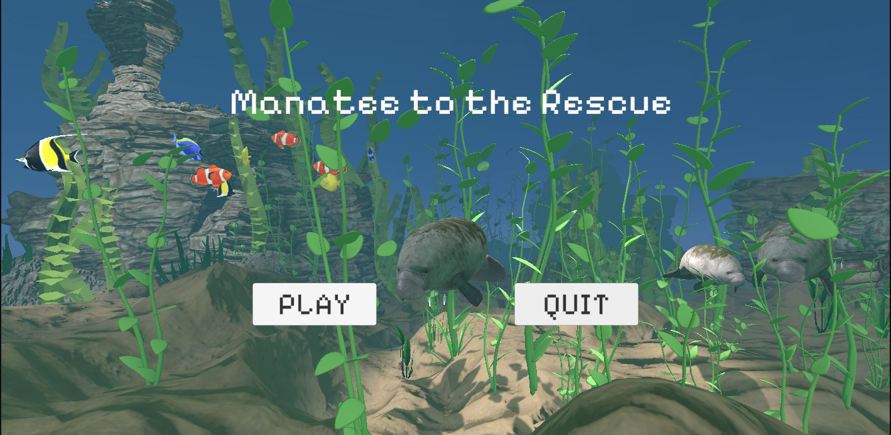
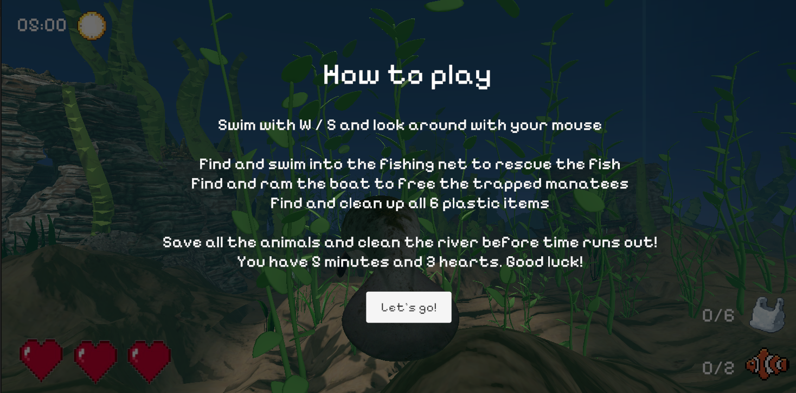
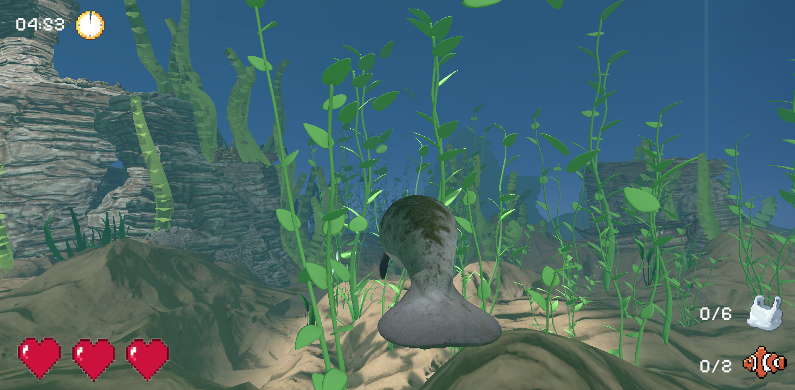
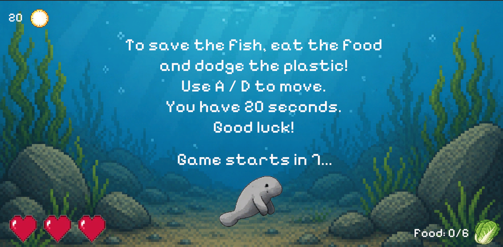

# Manatee to the Rescue (◕('''' 人 '''') ◕)

A 3D physics-based Unity game in which the player controls a manatee swimming through a polluted river, rescuing trapped sea animals. Mini-project for the Virtual Reality Programming course at Wrocław University of Science and Technology. 2-week development sprint.

## Concept

Navigate a contained river environment, interact with physics objects (plastic debris, fishing nets, boats), and rescue trapped animals before time runs out. Each rescued animal joins a growing underwater sanctuary in the main menu that acts like a persistent reward that builds across playthroughs.

> This is a proof of concept with one fully realised level. One animal per rescue mechanic is implemented; a full release would include additional levels, animal types, and mechanics.

## What's left for a full release
- 🎵 Music and sound effects
- 🐢 Additional animal types and rescue mechanics  
- 🌊 Improved water shader and visual polish
- 🗺️ Additional levels with increasing difficulty
- ⚡ Plastic cleanup minigames (skill check, wobble stabiliser)
- 🏆 Leaderboard / endless mode

## Scenes

**Main Menu** — animated underwater scene where previously rescued animals swim freely in the background. The sanctuary grows with each playthrough.

**Game Level** — a single polluted river level with physics navigation, animal rescues, and win/lose conditions. The player explores freely within a fog-bounded area.

**Win/Lose Overlays** — in-game panels with contextual messages and options to swim freely or return to menu.

**Minigame** — short retro-style 2D arcade screen triggered by reaching certain trapped animals (dodge mechanic).

## Core Systems

**Player & Physics**
- Rigidbody-based movement via Unity Input System (gravity disabled, drag tuned for floaty underwater feel)
- Cinemachine third-person follow camera
- Pushable debris, moving kinematic boat obstacles, trigger-based rescue zones

**Rescue Mechanics**
- Manatees freed by colliding with the physics obstacle trapping them
- Other animals trigger a 2D minigame — success frees the animal, failure costs a heart

**Health & Win/Lose**
- Hearts displayed on HUD, lost by colliding with boats, pollution, or failing a minigame
- Level lost when hearts run out or timer reaches zero
- Level won when all animals are rescued and all plastic trash is cleaned up in time

**UI**
- HUD: hearts, rescue counter, timer
- Pause menu, results screen, minigame UI
- Animated main menu background that evolves with player progress

## Tech Stack

Unity 6, C#, Unity Input System, Cinemachine, Unity Physics

 ## Screenshots

*Main menu with rescued animals*

*Intro panel with controls*

*River level with HUD*

*2D minigame intro*

## Asset Credits

| Asset | Author | License |
|-------|--------|---------|
| [Manatee](https://skfb.ly/pvPnD) | kenchoo | CC BY-SA 4.0 |
| [Underwater environment](https://skfb.ly/6tAqQ) | Conrad Justin | CC BY 4.0 |
| [School Of Fish](https://skfb.ly/6WpRz) | Titanas YT | CC BY 4.0 |
| [Fishing Net III](https://skfb.ly/pFvtJ) | gogiart | CC BY 4.0 |
| [Boat "Josefa"](https://skfb.ly/6GCS6) | Alexandre González Rivas | CC BY-NC 4.0 |
| [Sea Weed](https://skfb.ly/6SB6Q) | rkuhlf | CC BY 4.0 |
| [Underwater Assets Environment](https://skfb.ly/oNXCz) | KajaStud | CC BY 4.0 |
| [Underwater Play](https://skfb.ly/6SAyB) | Flip | CC BY 4.0 |
| [Fish](https://skfb.ly/6v9EQ) | Froggreen | CC BY 4.0 |
| [Blue Plastic Bag](https://skfb.ly/ozyvL) | dycember | CC BY-NC-SA 4.0 |
| [Low Poly Plastic Garbage Bags](https://skfb.ly/oIHo9) | Anna Denisova | CC BY 4.0 |
| [Plastic barrel](https://skfb.ly/o8oKI) | BlackMike | CC BY 4.0 |
| [Plastic Canister](https://skfb.ly/oJwzF) | hoxsvl | CC BY 4.0 |
| [Dirty Plastic Bottles Trash](https://skfb.ly/oGz9S) | Sunbox Games | CC BY 4.0 |
| [Remains](https://skfb.ly/6yoGs) | crazyshroomz | CC BY 4.0 |
| [AllSky Free Skybox](https://assetstore.unity.com/packages/2d/textures-materials/sky/allsky-free-10-sky-skybox-set-146014) | rpgwhitelock | Unity Asset Store free |
| [Yughues Free Sand Materials](https://assetstore.unity.com/packages/2d/textures-materials/floors/yughues-free-sand-materials-12964) | Nobiax | Unity Asset Store free |
